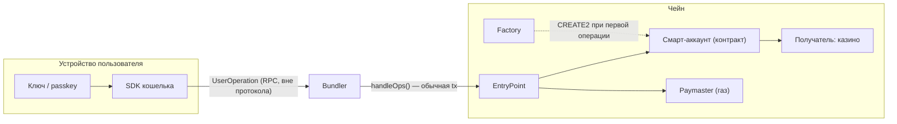
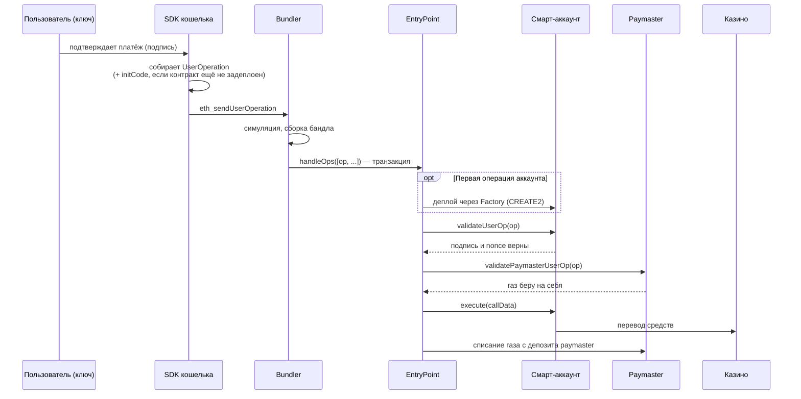
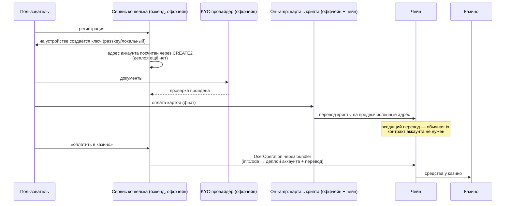

# Смарт-аккаунт (ERC-4337): устройство и флоу схемы «фиат → крипта → казино»

Описание по спецификации ERC-4337 (EIP-4337). Как устроен конкретный сервис — неизвестно; такие места помечены. Альтернативный стандарт EIP-7702 — в конце.

## 1. EOA vs смарт-аккаунт

| | EOA (обычный кошелёк) | Смарт-аккаунт (ERC-4337) |
|---|---|---|
| Что это на чейне | Пара ключей, кода нет | Смарт-контракт с кодом |
| Кто проверяет подпись | Протокол Ethereum (только ECDSA/secp256k1) | Сам контракт в `validateUserOp` — любая логика: passkey, мультисиг, лимиты |
| Кто платит газ | Только сам аккаунт, только в ETH | Кто угодно через paymaster (сервис, или списание в токене) |
| Адрес до первого использования | Существует сразу | Считается заранее через CREATE2, контракт деплоится при первой исходящей операции |
| Батчинг | Нет, 1 транзакция = 1 действие | `approve + transfer` одним вызовом |

Некастодиальность здесь означает: ключ, подпись которого контракт принимает в `validateUserOp`, хранится у пользователя (на устройстве, в passkey, или как доля в MPC). Сервис без этого ключа перевести средства не может.

## 2. Компоненты ERC-4337

- **UserOperation** — структура «что аккаунт хочет сделать»: sender, nonce, callData, лимиты газа, подпись. Это не транзакция Ethereum.
- **Bundler** — оффчейн-сервис. Принимает UserOperation по RPC (`eth_sendUserOperation`), собирает несколько в одну обычную транзакцию и отправляет в EntryPoint. Газ L1 платит bundler, компенсацию получает внутри `handleOps`.
- **EntryPoint** — синглтон-контракт (один на чейн, общий для всех). Оркестратор: валидация, списание газа, исполнение.
- **Account (смарт-аккаунт)** — контракт пользователя. Две обязанности: `validateUserOp` (проверить подпись и nonce) и исполнение callData.
- **Factory** — контракт, деплоящий аккаунты через CREATE2. Адрес аккаунта = f(factory, initCode, salt), поэтому известен до деплоя.
- **Paymaster** — контракт-спонсор газа. EntryPoint спрашивает его `validatePaymasterUserOp`; если согласен — газ списывается с депозита paymaster'а в EntryPoint. Так сервис делает «газ не нужен» для пользователя.

## 3. Схема компонентов

## 4. Жизненный цикл одной UserOperation

Ключевой момент: до первой исходящей операции контракта на чейне нет. Входящие переводы на предвычисленный адрес работают и без него — это обычный перевод на адрес.

## 5. Полный флоу: карта → KYC → крипта → казино

Часть шагов — оффчейн и зависит от реализации сервиса (помечено «оффчейн»).

## 6. Что контролирует сервис, а что нет

- **Не может**: перевести средства без подписи ключа пользователя — `validateUserOp` не пройдёт.
- **Может**: не пропустить операцию (свой bundler и paymaster — это точки отказа/цензуры). Пользователь в теории может уйти на публичный bundler и платить газ сам, если у аккаунта стандартный EntryPoint.
- **Зависит от реализации** (по конкретному сервису не проверено): recovery-механизмы (social recovery, ключ сервиса как guardian), session keys, лимиты в контракте аккаунта, MPC вместо локального ключа. Guardian-схемы могут давать сервису больше контроля, чем «чистая» некастодиальность.

## 7. EIP-7702 (кратко)

С хардфорка Pectra (май 2025) EOA может делегировать своему адресу код контракта (транзакция type 4 с authorization). Даёт EOA возможности смарт-аккаунта (батчинг, спонсирование газа) без смены адреса и без Factory. Часто комбинируется с инфраструктурой 4337 (bundler/paymaster). Использует ли это обсуждаемый сервис — неизвестно.

## 8. Непроверенное по конкретному сервису

- Какой стандарт: ERC-4337, EIP-7702, или собственная схема.
- Где ключ: локально, passkey, MPC-доля, и есть ли у сервиса guardian-права.
- Свой bundler/paymaster или сторонние (Alchemy, Pimlico, Biconomy и т.п.).
- Какая сеть и какой токен идут в казино.
