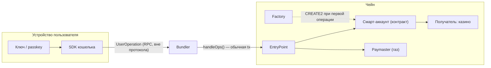
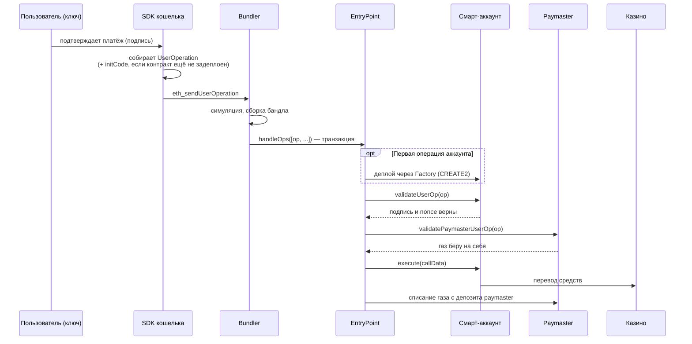
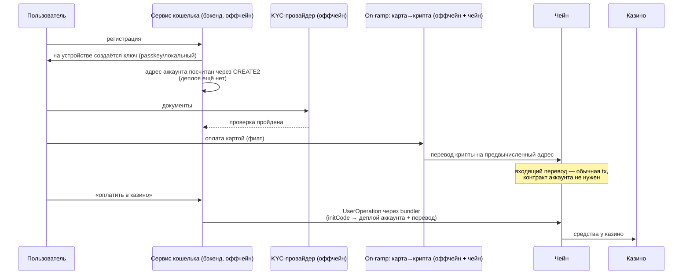

# Смарт-аккаунт (ERC-4337): устройство и флоу схемы «фиат → крипта → казино»

Описание по спецификации ERC-4337 (EIP-4337). Сервис на стадии проектирования: открытые решения собраны в разделе 8, выбор bundler/paymaster разобран в разделе 9. Альтернативный стандарт EIP-7702 — раздел 7.

## 1. EOA vs смарт-аккаунт

| | EOA (обычный кошелёк) | Смарт-аккаунт (ERC-4337) |
|---|---|---|
| Что это на чейне | Пара ключей, кода нет | Смарт-контракт с кодом |
| Кто проверяет подпись | Протокол Ethereum (только ECDSA/secp256k1) | Сам контракт в `validateUserOp` — любая логика: passkey, мультисиг, лимиты |
| Кто платит газ | Только сам аккаунт, только в ETH | Кто угодно через paymaster (сервис, или списание в токене) |
| Адрес до первого использования | Существует сразу | Считается заранее через CREATE2, контракт деплоится при первой исходящей операции |
| Батчинг | Нет, 1 транзакция = 1 действие | `approve + transfer` одним вызовом |

Некастодиальность здесь означает: ключ, подпись которого контракт принимает в `validateUserOp`, хранится у пользователя (на устройстве, в passkey, или как доля в MPC). Сервис без этого ключа перевести средства не может.

## 2. Компоненты ERC-4337

- **UserOperation** — структура «что аккаунт хочет сделать»: sender, nonce, callData, лимиты газа, подпись. Это не транзакция Ethereum.
- **Bundler** — оффчейн-сервис. Принимает UserOperation по RPC (`eth_sendUserOperation`), собирает несколько в одну обычную транзакцию и отправляет в EntryPoint. Газ L1 платит bundler, компенсацию получает внутри `handleOps`.
- **EntryPoint** — синглтон-контракт (один на чейн, общий для всех). Оркестратор: валидация, списание газа, исполнение.
- **Account (смарт-аккаунт)** — контракт пользователя. Две обязанности: `validateUserOp` (проверить подпись и nonce) и исполнение callData.
- **Factory** — контракт, деплоящий аккаунты через CREATE2. Адрес аккаунта = f(factory, initCode, salt), поэтому известен до деплоя.
- **Paymaster** — контракт-спонсор газа. EntryPoint спрашивает его `validatePaymasterUserOp`; если согласен — газ списывается с депозита paymaster'а в EntryPoint. Так сервис делает «газ не нужен» для пользователя.

## 3. Схема компонентов

## 4. Жизненный цикл одной UserOperation

Ключевой момент: до первой исходящей операции контракта на чейне нет. Входящие переводы на предвычисленный адрес работают и без него — это обычный перевод на адрес.

## 5. Полный флоу: карта → KYC → крипта → казино

Часть шагов — оффчейн и зависит от реализации сервиса (помечено «оффчейн»).

## 6. Что контролирует сервис, а что нет

- **Не может**: перевести средства без подписи ключа пользователя — `validateUserOp` не пройдёт.
- **Может**: не пропустить операцию (свой bundler и paymaster — это точки отказа/цензуры). Пользователь в теории может уйти на публичный bundler и платить газ сам, если у аккаунта стандартный EntryPoint.
- **Зависит от реализации** (решения при проектировании): recovery-механизмы (social recovery, ключ сервиса как guardian), session keys, лимиты в контракте аккаунта, MPC вместо локального ключа. Guardian-схемы могут давать сервису больше контроля, чем «чистая» некастодиальность.

## 7. EIP-7702: смарт-аккаунт на базе EOA

Вошёл в хардфорк Pectra (май 2025). Механика:

- Новый тип транзакции (type 4) с полем `authorization_list`. Каждый элемент — подпись владельца EOA над кортежем (chain_id, адрес контракта-делегата, nonce).
- При исполнении транзакции в код EOA записывается указатель делегирования — 23 байта `0xef0100 + адрес делегата`. После этого любой вызов на адрес EOA исполняет код делегата в контексте самого EOA: его storage, баланс, адрес.
- Делегирование постоянное, а не на одну транзакцию. Снимается или меняется новой authorization; делегирование на нулевой адрес очищает код.
- `chain_id = 0` в authorization делает её валидной на всех чейнах сразу — одной подписью аккаунт «включается» везде.
- Отправить транзакцию с чужой authorization может кто угодно: активацию можно спонсировать, пользователю не нужен ETH на газ даже для включения делегата.

Что даёт по сравнению с чистым 4337:

- Адрес не меняется: история, балансы и входящие переводы остаются на том же EOA. Не нужны Factory, CREATE2 и initCode.
- Если делегат совместим с 4337 (реализует `validateUserOp`), аккаунт дальше работает через ту же инфраструктуру: bundler, EntryPoint, paymaster, батчинг, session keys.

Отличия, важные при проектировании:

- Приватный ключ EOA продолжает существовать и остаётся выше логики делегата: им можно переделегировать на другой контракт и обойти любые лимиты, зашитые в делегат. Аккаунт «только passkey, без классического ключа» на 7702 не сделать — это даёт только нативный 4337-аккаунт, у которого правила проверки подписи целиком в контракте.
- Безопасность сводится к контракту-делегату: одна подписанная вредоносная authorization передаёт контроль над счётом.
- 7702 работает только на чейнах, включивших его в протокол; нативный 4337 от поддержки протокола не зависит.

## 8. Открытые вопросы проектирования

- Какой стандарт: ERC-4337, EIP-7702 поверх EOA, или их комбинация.
- Где ключ: локально, passkey, MPC-доля; давать ли сервису guardian-права на восстановление.
- Свой bundler/paymaster или сторонние — разобрано в разделе 9.
- Сеть: кандидаты — Base или Arbitrum, решение не финальное. Токен не выбран.

## 9. Bundler и paymaster: свои или сторонние

Это два независимых выбора. Bundler — оффчейн-инфраструктура, paymaster — контракт плюс оффчейн-сервис политики. Комбинации допустимы: сторонний bundler со своим paymaster'ом и наоборот.

### Сторонние провайдеры (Alchemy, Pimlico, Biconomy, ZeroDev и т.п.)

- Дают bundler RPC и paymaster API; политики спонсирования настраиваются у них: лимиты, списки разрешённых контрактов, подпись разрешений.
- Оплата — счёт за газ плюс наценка; модель тарификации у каждого своя, смотреть при выборе.
- Зависимости: rate limits и SLA провайдера; провайдер видит операции пользователей; это точка отказа и цензуры.
- Отдельно для этого продукта: у провайдеров есть политики допустимого использования, гемблинг может попадать под ограничения. Проверить ToS конкретного провайдера до интеграции (не проверял).

### Свой bundler

- Операционно это сервис с 4337-RPC (`eth_sendUserOperation` и связанные методы): симуляция валидации по правилам ERC-7562, сборка `handleOps`, отправляющие EOA с запасом ETH на газ, обработка ревертов и реоргов, поддержка актуальных версий EntryPoint.
- С нуля писать не нужно: есть open-source реализации (референсный bundler eth-infinitism, Rundler, Skandha и др.); «свой» обычно означает развернуть и эксплуатировать готовую.
- Плюсы: без наценки и чужих лимитов, контроль очереди, операции пользователей не уходят третьей стороне.
- Минусы: эксплуатация на себе — мониторинг, дежурства, обновления под новые версии EntryPoint.

### Свой paymaster

Два типовых вида:

- **Verifying (спонсирующий).** Оффчейн-сервис проверяет операцию по своим правилам и подписывает разрешение; контракт проверяет подпись в `validatePaymasterUserOp`. Газ платит сервис. Нужны лимиты на пользователя, привязка к KYC-статусу, защита от накрутки спонсируемого газа.
- **ERC-20.** Газ списывается с пользователя в токене (например, USDC) по курсу из оракула. Для этого флоу существенно: после on-ramp на счету пользователя только купленный токен, ETH на газ нет. Значит газ либо спонсируется, либо списывается через ERC-20 paymaster.

Операционно: депозит ETH в EntryPoint (из него списывается газ) и stake по правилам публичного мемпула; автопополнение депозита и мониторинг остатка; для ERC-20 — обновление курса.

### Комбинация на старте

Частый вариант: сторонний bundler плюс verifying paymaster с политиками (контракт свой или провайдерский). Здесь порядок проверки другой: сначала политики провайдеров по гемблингу; если гемблинг под запретом, остаётся только свой bundler и paymaster.
